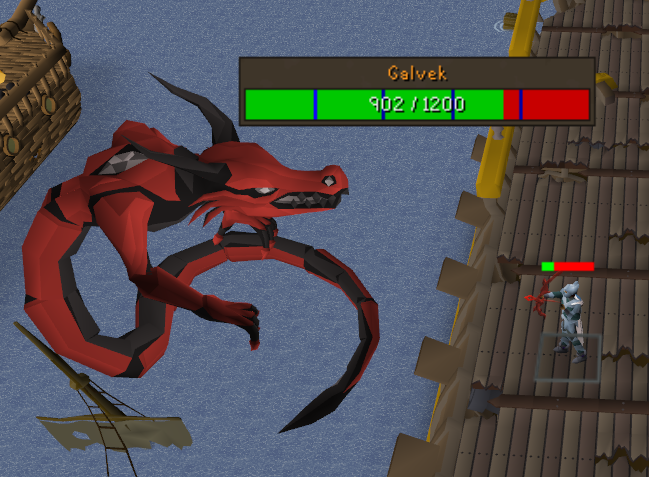
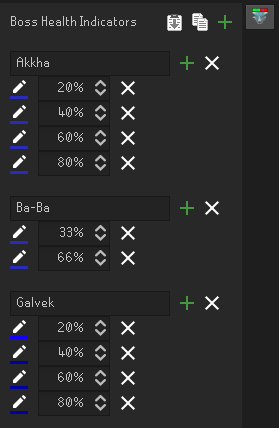

# boss-health-indicators 

A runelite plugin that adds customizable indicators on boss hp bars

#Getting Started
You can use the panel to add your own boss indicators. For an example, you can copy the indicator setup below and use the "import" button in the panel to load these markers for TOA:

```[{"bossName":"Akkha","entries":[{"percentage":0.2,"color":"#FF2B2BBA"},{"percentage":0.4,"color":"#FF2B2BBA"},{"percentage":0.6,"color":"#FF2B2BBA"},{"percentage":0.8,"color":"#FF2B2BBA"}]},{"bossName":"Ba-Ba","entries":[{"percentage":0.33,"color":"#FF2B2BBA"},{"percentage":0.66,"color":"#FF2B2BBA"}]}]```


#Panel

