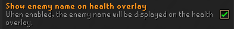

# boss-health-indicators 

A runelite plugin that adds customizable indicators on boss hp bars.

Note: The boss must have a health bar like pictures below!

# Getting Started

You can use the panel to add your own boss indicators. For an example, you can copy the indicator setup below and use the "import" button in the panel to load these markers for TOA:

`[{"bossName":"Akkha","entries":[{"percentage":0.2,"color":"#FF2B2BBA"},{"percentage":0.4,"color":"#FF2B2BBA"},{"percentage":0.6,"color":"#FF2B2BBA"},{"percentage":0.8,"color":"#FF2B2BBA"}]},{"bossName":"Ba-Ba","entries":[{"percentage":0.33,"color":"#FF2B2BBA"},{"percentage":0.66,"color":"#FF2B2BBA"}]},{"bossName":"Zebak","entries":[{"percentage":0.25,"color":"#FF3A00FF"}]},{"bossName":"Tumeken\u0027s Warden","entries":[{"percentage":0.2,"color":"#FF3A00FF"},{"percentage":0.4,"color":"#FF3A00FF"},{"percentage":0.6,"color":"#FF3A00FF"},{"percentage":0.8,"color":"#FF3A00FF"},{"percentage":0.05,"color":"#FFFF0000"}]}]`

# Regular Expressions

You can use regular expressions to match manyh bosses at once. For instance, if you want to add a mark for every boss at 20%, just create a boss listing for ".\*" and an indicator for 20%.

# Panel

# Common Problems

- Ensure this setting is enabled, otherwise the plugin cannot locate which boss you are fighting.

# Image Source

- Vorkath for icon - [Image](https://oldschool.runescape.wiki/w/File:Vorki_detail.png)
